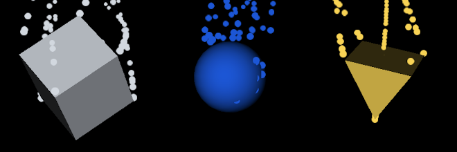
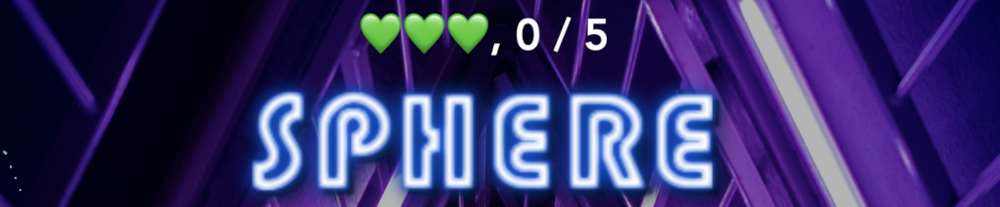

# WWDC20-FigureBreaker
Accepted project submission for the WWDC2020 Scholarship

# Welcome to the FigureBreaker!

Put your reaction and attention to detail in this game!

# Instructions
* Three types of figures are randomly created and launched into the scene: **Box**, **Sphere**, and **Pyramid**:



* To win the game, you need to hit target figures and ignore others. Remember that not only do you need to take into account the type of the figure, but also its **color**. We have the following colors in the game:


* Depending on the **GameLevel**, you will have to successfully hit either 5 (for **.feasible**) or 10 (for **.challenging**) target figures to win the game (the rate of figure launching will also be different):

```swift
let gameScene = GameScene(gameLevel: .feasible)
```

* Move your cursor or finger around the screen and "slice" figures. Be careful not to hit wrong figures, you have only **3** lives!

* The target figure randomly changes and is displayed on the top of the scene:


# Enjoy!
